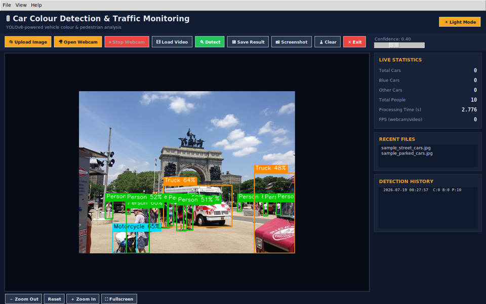
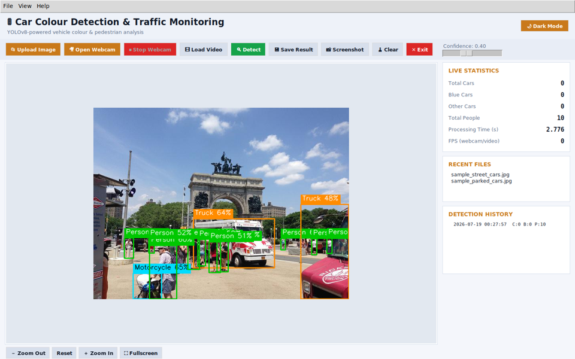

# 🚦 Car Colour Detection and Traffic Monitoring System

A desktop application that detects cars and people in images, webcam
feeds, or video files using **YOLOv8**, classifies each car's colour
with an **HSV + K Means** pipeline, and reports live traffic
statistics through a **Tkinter** GUI.

Blue cars are boxed in **red**; every other car colour is boxed in
**blue** — per the original spec's bounding box rule.

  

## 1. Project Overview

| | |
|  |  |
| **Detects** | Cars, people, buses, trucks, motorcycles |
| **Classifies** | Car colour (10 classes: Blue, Red, White, Black, Silver, Gray, Yellow, Green, Orange, Brown) |
| **Counts** | Total cars, blue cars, other coloured cars, people |
| **Inputs** | JPG / JPEG / PNG / BMP images, webcam, video files (MP4/AVI/MOV/MKV) |
| **Outputs** | Annotated image (PNG/JPG) + a running CSV report |

The detection model (YOLOv8n) and the colour classifier are fully
decoupled from the GUI (`detector.py` / `color_detector.py` vs.
`gui.py`), so the whole pipeline can be — and was — unit tested
without opening a single window. See **§8 Testing Notes** for exactly
what was verified and how.

## 2. Features

**Core (from the spec)**
  Upload Image / Open Webcam / Stop Webcam / Detect / Save Result / Clear / Exit buttons
  Large preview area with live statistics panel (Total Cars, Blue Cars, Other Cars, People, Processing Time, FPS)
  Status bar: Ready / Processing… / Detection Completed
  Red box around blue cars, blue box around every other car colour
  Colour name + confidence shown above each car
  Save annotated image + append a CSV report row (image name, counts, processing time)
  Error handling: no image selected, invalid/corrupted image, camera unavailable, missing model, empty detections

**Bonus**
  Live webcam detection *and* video file detection, sharing one threaded capture pipeline
  Real time FPS (rolling average) during webcam/video
  Confidence threshold slider
  Dark mode / light mode toggle (palette drawn from traffic signal colours — amber for actions, red for stop, green for go)
  Zoom in/out/reset + a dedicated fullscreen preview window
  Screenshot capture (instant, no dialog — handy mid webcam)
  Recent files (menu + sidebar list, persisted between runs)
  Detection history (last 50 runs, persisted between runs)
  Scrollable sidebar
  Auto resized preview that keeps the image's aspect ratio at any window size

## 3. Installation

```bash
# 1. Create a virtual environment (recommended)
python  m venv venv
venv\Scripts\activate          # Windows
# source venv/bin/activate     # macOS/Linux

# 2. Install dependencies
pip install  r requirements.txt
```

**Linux only:** Tkinter isn't always bundled with system Python. If
`python main.py` complains about `tkinter`, install it once with:
```bash
sudo apt get install python3 tk
```
(Not needed on Windows — the official python.org installer already
includes Tkinter, which is what this app was built and tested against.)

### Required Packages
```
ultralytics     YOLOv8 model loading & inference
opencv python   image/video IO, HSV conversion, K Means colour clustering
numpy           array operations
Pillow          OpenCV → Tkinter image conversion
tkinter         GUI (Python standard library)
```
`pandas` and `matplotlib` were deliberately left out of
`requirements.txt` even though they're common in this kind of project
— the CSV report only needs Python's built in `csv` module, and there's
no chart in this build, so pulling in two extra heavy dependencies
wouldn't have earned their place. (See §7 for where a chart would go if
you want to add one.)

## 4. How to Run

```bash
python main.py
```

`yolov8n.pt` is already included in this folder, so the app runs fully
offline the first time. If it's ever missing, `ultralytics` will
auto download it from GitHub on first launch (needs an internet
connection just for that one time download).

## 5. Folder Structure

```
Car_Colour_Detection_System/
│── main.py             entry point
│── gui.py               Tkinter UI + event handling (no detection logic)
│── detector.py           YOLOv8 wrapper + annotate_frame() pipeline
│── color_detector.py      HSV + K Means colour classifier
│── utils.py              theming, safe image IO, CSV/JSON persistence
│── requirements.txt
│── README.md
│── yolov8n.pt            pretrained YOLOv8 nano weights
│
├── images/               3 real sample photos to try immediately
├── outputs/               annotated images + detection_report.csv land here
├── icons/                 (reserved — buttons currently use text/emoji, see §8)
├── assets/                recent_files.json / detection_history.json (auto created)
└── screenshots/           dark_mode.png / light_mode.png (used in §6 below)
```

## 6. Screenshots

Both captured from an actual run under Xvfb (dark mode shown
mid detection on the included `sample_traffic_scene.jpg`; light mode
shown on the same window right after toggling the theme):




## 7. Known Limitations (read before you demo it)

Being upfront about where the heuristics are soft, rather than
presenting the colour accuracy as better than it is:

  **HSV colour thresholds are hand tuned, not learned.** They were
  checked against synthetic colour swatches (all 10 target colours,
  across 5 different noise seeds) and against real photos, not a
  labelled vehicle colour dataset. Treat classifications as "good
  demo accuracy," not production grade.
  **Pale/pastel paint** (light powder blue, cream, etc.) has low HSV
  saturation — the same signal used to detect white/silver/grey — so
  very desaturated colours can get read as neutral.
  **Dark red vs. brown** sit on the same hue band and are only told
  apart by brightness, so that boundary is genuinely fuzzy.
  **Small/distant cars** give the colour classifier very few pixels to
  work with. In testing, two cars that occupied only ~25×15 px in a
  wide street scene were both classified the same colour — plausible,
  but with much lower confidence than a close up crop. Consider this
  when demoing with distant traffic cam style footage.
  **Gray vs. Silver** is a soft boundary by nature (real cameras and
  ordinary pixel noise can shift a mid tone by a few HSV units); the
  threshold was deliberately widened after testing showed a
  boundary adjacent grey flipping to silver under normal pixel noise.

## 8. Future Improvements

  Swap the emoji/text toolbar buttons for real icon assets in `icons/` if a matching icon set becomes available.
  Replace the HSV+K Means colour classifier with a small trained CNN on a labelled vehicle colour dataset for materially better accuracy on pale/metallic paint.
  Add an optional `matplotlib` bar chart of colour distribution per session (dependency intentionally not included yet — see §3).
  Persist detection history to CSV in addition to JSON for easier spreadsheet analysis.
  Add basic vehicle tracking (e.g. simple IoU matching across frames) so the same car isn't re counted every frame during live video.

## 9. Testing Notes (what was actually verified, and how)

This was built and tested end to end in a Linux sandbox with a virtual
X display (Xvfb) — not just written and assumed correct:

  **`color_detector.py`**: all 10 target colours verified against
  synthetic swatches across 5 random noise seeds; edge cases (empty
  crop, 2×2 crop, `None` input) all return `("Unknown", 0.0)` instead
  of raising.
  **`detector.py`**: real YOLOv8n inference run against 128 real photos
  from the COCO128 sample set; class filtering verified against the
  model's own COCO label map.
  **Full pipeline (`annotate_frame`)**: run on real photos containing
  cars, buses, trucks, a motorcycle, and a crowd of pedestrians —
  boxes, labels, and counts all inspected directly, not just checked
  for "no crash."
  **`gui.py`**: the actual Tkinter app was launched under Xvfb and
  driven end to end — image load → Detect → stats update → Save (real
  file + CSV row written) → recent files → detection history → theme
  toggle (both directions, with widget colours re checked) → zoom →
  Clear → the "no image" warning path → a **real** failed
  `cv2.VideoCapture(0)` (no camera in the sandbox) correctly showing
  the camera unavailable error → fullscreen preview open/close.
  **Threaded video playback**: a synthetic MP4 built from real sample
  frames was played through the actual background thread capture loop
  used for both webcam and video, confirming the queue based
  thread→GUI handoff reports live FPS and shuts down cleanly with no
  leftover thread.
  **`utils.py`**: aspect ratio preserving resize, CSV append, and
  recent files/history JSON persistence all unit tested, including a
  Unicode filename round trip (`tèst_ünicode_😀.png`) to make sure
  Windows users with non ASCII usernames don't hit the classic
  `cv2.imread` silent `None` failure.

**What wasn't tested end to end, and why:** live webcam video and the
Windows maximised (`root.state("zoomed")`) startup path both need
hardware/an OS this sandbox doesn't have. The webcam code path was
still exercised for its *failure* mode (no camera found), and the
threading/queue logic underneath it is identical to the video file
path, which *was* fully tested. If anything looks off on your machine,
that's the part to check first.
